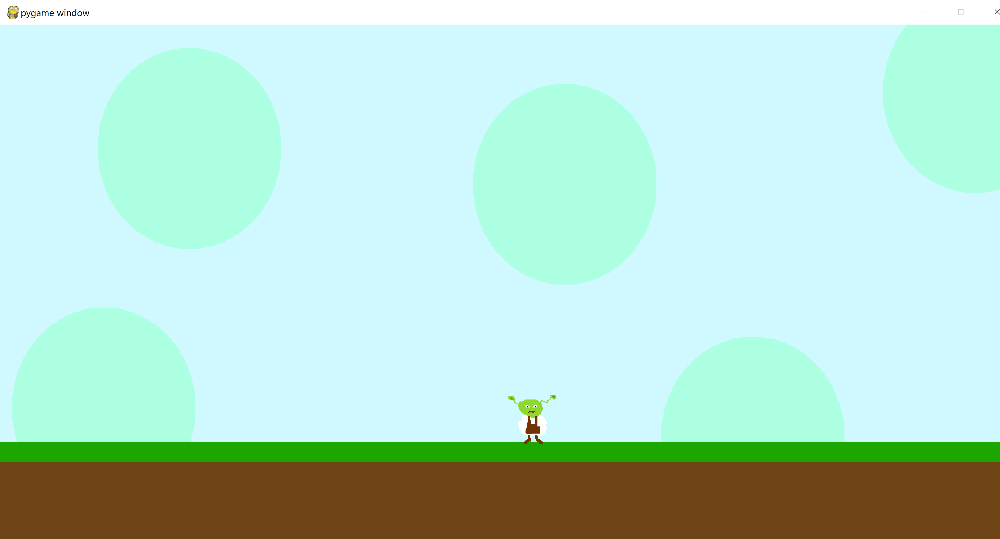

# Python ja Pygame -pelini

A game written in Python and Pygame to teach in the 2019 Kodarit course.
The material used was developed and taught to kids aged 10-13 by me.
The course was taught in Finnish; therefore, all of the documentation and code is in Finnish as well.

-----

Aja avaamalla PowerShell ikkuna ja kirjoittamalla `py <tiedostonimi>.py`

(c) PixelSergey, Kodarit, 2019
